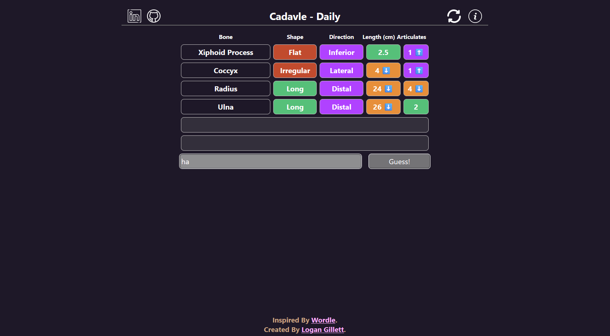

[![Contributors][contributors-shield]][contributors-url]
[![Forks][forks-shield]][forks-url]
[![Stargazers][stars-shield]][stars-url]
[![Issues][issues-shield]][issues-url]
[![MIT License][license-shield]][license-url]

<!-- Project Info -->

<h1>Cadavle</h1>

    Cadavle is a Wordle-inspired web game with the objective of figuring out which bone in the body based on hints given by previous guesses. Created with Node.js, powered by Vercel.

<!-- Project INFO -->
## More on the Project

Cadavle was made originally for friends to test their anatomy knowledge of bones in a fun way; inspired by something we all play as a somewhat daily tradition: Wordle.

The general premise of the game is simple, the player has 6 attempts to guess the correct bone
(or bone group in some cases), and is given hints from their guess based on if it is the same type,
the direction, the length, and the number of bones that guess touches. After each guess,
colours indicate weather the guess is incorrect,
(red), correct (green), too high (orange), or too
low (blue), which will help the player with future guessing. Below you can see what a full game might look like. I truly hope you enjoy it! It was made for my girlfriend, though I know many anatomy lovers will have some fun too!

<!-- LICENSE -->
## License

Distributed under the MIT License. See `LICENSE.txt` for more information.

<!-- CONTACT -->
## Contact Me

 
    &nbsp;
       
    &nbsp;&nbsp;
    

<!-- MARKDOWN LINKS & IMAGES -->
<!-- https://www.markdownguide.org/basic-syntax/#reference-style-links -->
[contributors-shield]: https://img.shields.io/github/contributors/logagill489/Cadavle.svg?style=for-the-badge
[contributors-url]: https://github.com/logagill489/Cadavle/graphs/contributors

[forks-shield]: https://img.shields.io/github/forks/logagill489/Cadavle.svg?style=for-the-badge
[forks-url]: https://github.com/logagill489/Cadavle/network/members

[stars-shield]: https://img.shields.io/github/stars/logagill489/Cadavle.svg?style=for-the-badge
[stars-url]: https://github.com/logagill489/Cadavle/stargazers

[issues-shield]: https://img.shields.io/github/issues/logagill489/Cadavle.svg?style=for-the-badge
[issues-url]: https://github.com/logagill489/Cadavle/issues

[license-shield]: https://img.shields.io/github/license/logagill489/Cadavle.svg?style=for-the-badge
[license-url]: https://github.com/logagill489/Cadavle/blob/main/LICENSE.txt
